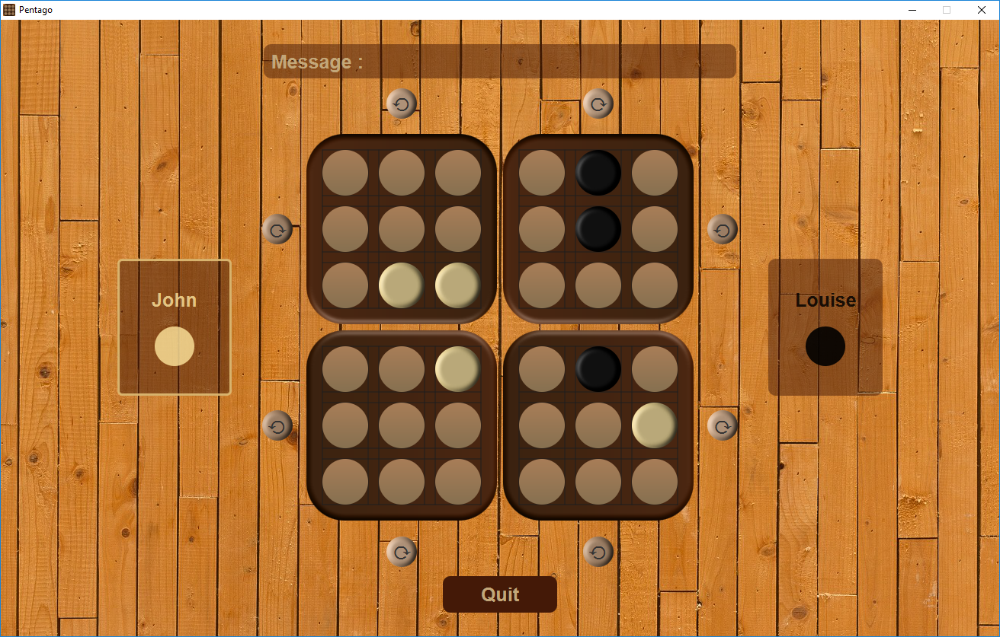

# Pentago  

[](https://www.gnu.org/licenses/gpl-3.0)




## Description

Pentago is a strategy game for two players. As illustrated in Figure 1, it consists of a 6x6 box tray, itself divided into four 3x3 quadrants. This game is supplied with 18 white and 18 black balls, at the beginning of the game the player associated with the white color is determined. This player will start the game. Each turn, a player places a colored ball on a free square on the board. Then the player decides to turn the quadrant on which he has placed his billed' a quarter turn to the right or left. a player wins by aligning five of his balls in a vertical or horizontal row (before or after the rotation of the quadrant). If each of the 36 squares is occupied without forming a row of five balls of the same color, the game is drawn.

See more rules informations [here](PentagoRulesStrategy.pdf).

NB: (small rule change) even if two players have lined up 5 balls after turning a quadrant, only the current player will be designated as the winner.

## Technologies

**Language**
- Java version: 11

**Framework/Library**
- JavaFX version: 11
- JUnit version: 4

**Build tool**
- Maven version: 3.6.x

## Setup

To run this little game, you will need at least [Java 11](https://www.oracle.com/java/technologies/javase/jdk11-archive-downloads.html) and [Maven 3](https://maven.apache.org/download.cgi) on your machine.

```
git clone https://github.com/JeremyGillard/pentago-game.git
cd pentago-game
mvn javafx:compile
mvn javafx:run
```

## Additional Informations

### Code (additional information - comments)

Only small inconsistency between the console view and the graphical view. I had to put the isOver check in the ball placement and quadrant rotation methods for the mistletoe while for the console view, the isOver method is used for the controller loop.

(Cancelled due to the size of the wav file: file not included). For a more pleasant gaming experience, it is possible on most operating systems to uncomment line 20 in be.jeremygillard.pentago.gui.App : initSurroundingMusic().

## Model Structure

There are **4** main parts to this project:
+ The part to manage the console view (be.jeremygillard.pentago.**console**)
+ The part to manage the graphical view (be.jeremygillard.pentago.**gui**)
+ An utility part (be.jeremygillard.pentago.**util**) 
+ And finally the most important part, the model of our game (be.jeremygillard.pentago.**model**).

```java
public class Author {
    public static void main(String[] args) {
        System.out.println("Pentago v2.0 finished. Have Fun !");
    }
}
```

### Other
The commits structure are highly inspired by the Angular "Commit Message Conventions".

Briefly, the pattern look like this:

\<type\>(\<scope\>): \<subject\>
\<description\>
\<footer\>

NB: (Customization) In my projects, I will try at best to refer to parts of Model Structure for the header <scope>.

[For more information](https://gist.github.com/stephenparish/9941e89d80e2bc58a153#file-commit-md)

### Dev tips

[Setting up Javafx](https://openjfx.io/openjfx-docs/#introduction)  
[Git lfs migration](https://notiz.dev/blog/migrate-git-repo-to-git-lfs#4-migrate-git-history)
