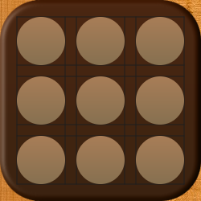

# Pentago 

## Description

Pentago is a strategy game for two players. As illustrated in Figure 1, it consists of a 6x6 box tray, itself divided into four 3x3 quadrants. This game is supplied with 18 white and 18 black balls, at the beginning of the game the player associated with the white color is determined. This player will start the game. Each turn, a player places a colored ball on a free square on the board. Then the player decides to turn the quadrant on which he has placed his billed' a quarter turn to the right or left. a player wins by aligning five of his balls in a vertical or horizontal row (before or after the rotation of the quadrant). If each of the 36 squares is occupied without forming a row of five balls of the same color, the game is drawn.

See more rules informations [here](PentagoRulesStrategy.pdf).

NB: small rule change: even if two players have lined up 5 balls after turning a quadrant, only the current player will be designated as the winner.

## Model Structure

## Additional Informations

Java build tool used: Ant

### Code (additional information - comments)

### Other
The commits structure are highly inspired by the Angular "Commit Message Conventions".

Briefly, the pattern look like this:

\<type\>(\<scope\>): \<subject\>
\<description\>
\<footer\>

NB: (Customization) In my projects, I will try at best to refer to parts of Model Structure for the header <scope>.

[For more information](https://gist.github.com/stephenparish/9941e89d80e2bc58a153#file-commit-md)

In the future, I would also like to draw inspiration from the advice given in [this article](https://bulldogjob.com/news/449-how-to-write-a-good-readme-for-your-github-project) in my future projects.

### Licensing

With confirmation from my laboratory supervisor I would like to post this project on my personal github with the license below (to be confirmed).

Question: Can a real game under private license be licensed to copy-left in the "digital world"?

This app is Licensed under the GNU General Public License v3.0. See [LICENSE](LICENSE) for the full license text.

